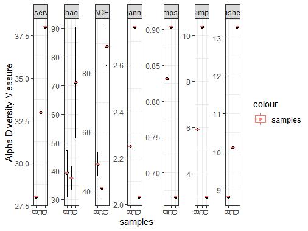
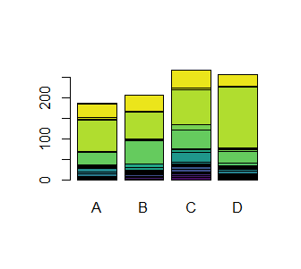
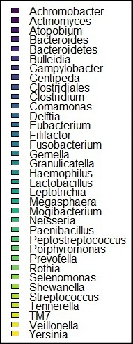
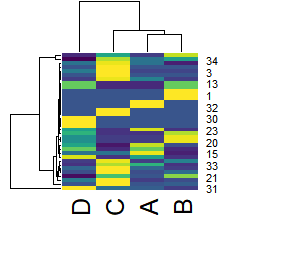
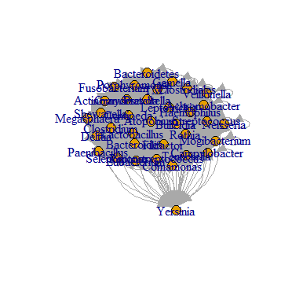

```{r setup, include=FALSE}
knitr::opts_chunk$set(echo = TRUE)
```

## Introduccion

Se realizaron analisis de diversidad, riqueza y abundancia con datos obtenidos por Pei y colaboradores, publicados en el articulo "*Bacterial biota in the human distal esophagus*" en la revista Proceedings of the National Academy of Sciences (***PNAS***) en el ano 2004. Los autores examinaron 4 biopsias de esofago normal de adultos humanos usando PCR de ADNr 16s de amplio rango. En este proyecto se pretende estudiar la riqueza y diversidad de las especies caracterizadas por los autores, asi como su relevancia en cuanto a la abundancia de estas bacterias en el esofago de un adulto sano.

### Instalacion de librerias

Se utilizo el paquete phyloseq que es una herramienta para manipular, almacenar y analizar datos de secuenciacion filogenetica que se han agrupado en unidades taxonomicas operativas (OTU). Este paquete usa herramientas disponibles en R para la ecologia y el analisis filogenetico, por lo que tambien se cargaron las librerias ggplot2 (para producir graficos con calidad de publicacion), y la paleta de colores viridis disponible para usar con ggplot.

Fuente: <https://joey711.github.io/phyloseq/>

<https://www.rdocumentation.org/packages/viridisLite/versions/0.4.0/topics/viridis>

``` r
{#En caso de contar con las librerias instaladas, saltar el paso de instalacion para optimizar tiempo
  
#Instalacion de paquetes 
install.packeges(phyloseq) 
install.packeges(ggplot2) 
install.packages(viridis) 
install.packages(igraph)
#Cargar las librerias 
library("phyloseq") 
library("ggplot2") 
library("viridis")
library("igraph")
```

### Cargar las bases de datos

La base de datos esophagus esta disponible en el paquete phyloseq, por lo que solo se necesita cargar la libreria y despues ejecutar el siguiente codigo.

``` r
data(esophagus)

#Los datos engloban ciertas tablas, el siguiente comando es para visualizar el contenido del archivo phyloseq
View(esophagus)
```

La base de datos solamente cuenta con el archivo otu_table, el archivo de taxa y sample no estan incluidos en esta base de datos. Se guardara el archivo otu en un objeto de R para poder manipularlo.

``` r
#Visualizar los datos antes de guardarlos
View(otu_table(esophagus))
#Cada renglón es una taxa y cada columna es una muestra
#Guardar la tabla en un nuevo objeto para poder manipularlo
otu <- otu_table(esophagus)
```

Debido a que esta base de datos solo incluye el archivo de OTU y este solo contiene la informacion de la muestra B,C y D, se realizo una busqueda en el material complementario del articulo de refencia. Se identificaron dos tablas complementarias que contenian la informacion taxonomica de las especies identificadas, asi como las abundancias de las mismas. A partir de estas tablas y de otu_table se construyeron seis matrices.

1.  arbol_matriz: Una matriz de prescencia/auscencia (solamente incluye 0 y 1 como caracteres numericos) para indicar si una especie se encuentra en la muestra. No se toma en cuenta el numero de OTUs.

2.  matriz: Se asignaron nombres de genero y especie a la matriz otu_table y se consideraron las 4 muestras con sus abundancias, asi como el numero total de OTU por especie. En total se identificaron 96 especies.

3.  matriz_abun: Se asignaron nombres solo a nivel de genero, para cuantificar las abundancias de cada genero en las 4 muestras. Se identificaron 35 generos.

4.  matriz_rique: Matriz que cuantifica el numero de especies identificadas para cada uno de los 35 generos encontrados.

5.  OTU: Matriz cuadrada que relaciona la prescencia de los generos bacterianos en las cuatro muestras.

6.  taxa: A partir de una revision bibliografica se le asigno a cada OTU su clasificacion taxonomica completa (reino, phylum, clase, orden, familia, genero y especie).

``` r
#Cargar las bases de datos a partir de la carpeta contenida en el Rproyect de datos crudos

matriz <- read.csv("../Raw_data/matriz.csv")
arbol_matriz <- read.csv("../Raw_data/arbol_matriz.csv")
matriz_abun <- read.csv("../Raw_data/matriz_abun.csv")
OTU <- read.csv("../Raw_data/OTU.csv")
matriz_rique <- read.csv("../Raw_data/matriz_rique.csv")
taxa <- read.csv("../Raw_data/taxa.csv")
```

## Construccion de una filogenia por clusterizacion

Se construyo un dendograma mediante un Analisis de clusterizacion jerarquico, este es un metodo de division que agrupa a las muestras de acuerdo a la similitud de los mismos a partir de una matriz de distancia. El criterio para determinar la similitud entre las cuatro muestras de esofagos fue que tantas especies de bacterias comparte.

Los numeros 1,2,3,4 corresponden a las muestras A,B,C,D respectivamente

``` r
#Cargar la matriz de prescencia/auscencia
head(arbol_matriz)
#calculo de la matriz de distancia con el metodo Euclideano
dist_mat <- dist(arbol_matriz, method = "euclidean")
#clusterizacion a partir de la matriz de distancia por el metodo Average
model <- hclust(dist_mat,"average")
#dendograma a partir del metodo de clusterizacion
dendograma <- as.dendrogram(model)
plot(dendograma)
```


Se observo que la muestra A y B que corresponde a una paciente femenina de 75 anos y a un masculino de 49 anos respectivamente, se agruparon como un clado que se relaciona mas con la muestra C que proviene de un paciente masculino de 74 anos. La muestra D proveniente de un paciente masculino de 79 anos es similar a la muestra C. A los pacientes A y C se les indico hacerse la endoscopia porque presentaban anemia por deficiencia de hierro, al paciente B por dolor abdominal y al D porque presentaba disfagia. En los cuatro casos el estatus histologico del esofago analizado fue normal.

## Analisis de riqueza y diversidad alfa

Para el calculo de la diversidad alfa se tomaron en cuenta al indice de Chao, Shannon, Simpson, Fisher, Observed y ACE. Todos los indices unen dos elementos de la diversidad, la equitatividad, o sea la variabilidad en las abundancias relativas de las especies de la comunidad, y la riqueza, o sea el numero total de especies que componen la comunidad.

Fuente: <https://ciespinosa.github.io/AlphaDiversidad/>

Se realizo un analisis de riqueza a partir del archivo original otu_table contenido en el objeto otu, este objeto generado por los autores del articulo descarta a la paciente A.

``` r
#Se genero un grafico de riqueza usando diferentes estimadores de diversidad
riqueza <- plot_richness(otu)
#A partir del anterior usando la funcion geom_boxplot se le añadio boxplot para ver las barras de error
riqueza2 <- riqueza + geom_boxplot(data=riqueza$data, aes(color="samples"), alpha=0.1)
```



Los puntos rojos representan la estimacion de riqueza y las lineas el rango de error estandar teorico asociado con esa estimacion, respectivamente, y se superpone un diagrama de caja para las tres muestras. La muestra con mayor riqueza es la C de acuerdo al indice de Shannon, Simpson y Fisher. De acuerdo a los observados, al indice de Chao y ACE la muestra D muestra mayor riqueza. En todos los casos la muestra B presenta menor estimacion de riqueza.

## Analisis de abundancia

Para representar a los generos mas abundantes en cada una de las cuatro muestras se realizo un barplot que separa por colores a los 35 generos. La imagen de etiquetas para distinguir entre los generos mas abundantes se muestra aparte para no afectar la calidad de los graficos.

``` r
head(matriz_abun)
#Se uso la libreria viridis para crear un vector de identificacion por colores para los generos identificados

#La funcion viridis esta asignando un color para cada genero extraido de la matriz de abundancia 
colours <- viridis::viridis(length(unique(matriz_abun$Genero)))
#en este objeto se junta el vector de color con los nombres de los generos usando la funcion match
color.indices <- match(matriz_abun$Genero, unique(matriz_abun$Genero))
#Genera un vector con color para cada genero llamado colvec
colvec <- colours[color.indices]
```

``` r
#Usando el vector colvec se hizo un barplot para ver las abundancias por genero
#se descarta la primera columna que se refiere a los nombres porque ya estan contemplados en colvec
#La segunda parte corresponde a la asignacion de la leyenda de identificacion de los generos y su ubicacion usando la funcion legend
generos <- barplot(as.matrix(matriz_abun[,-1]), col=colvec)+
legend('bottomright', fill=colours,legend = matriz_abun$Genero)
```

Se realizo un heatmap utilizando la matriz de abundancia para ver de manera grafica los generos con mas OTUs identificados en cada muestra.

``` r
#Se utilizó el vector colvec creado para el barplot
generos2 <- heatmap(as.matrix(matriz_abun[,-1]), col=colvec)+
  legend('bottomright', fill=colours,legend = matriz_abun$Genero)
```

{width="330"}

{width="114"}

{width="328"}

{width="119"}

Con base en los resultados del articulo y correlacionándolos con los analisis obtenidos en el proyecto, se concluye lo siguiente. En el articulo se menciona que principalmente las familias de bacterias con mayor prevalencia en las muestras corresponden a la de firmicutes y bacteroides. Los bar plots de los pacientes A,B,C,D muestran mayor presencia de *Streptoccoccus* pertenecientes a los Firmicutes y de la clase de *Prevotella* pertenecientes a los bacteroides. Algo importante a destacar, es que se conoce perfectamente que *Streptoccoccus y Prevotella*, se encuentran con mayor presencia en otras partes que conforman al sistema digestivo, empezando por la garganta y la mucosa yugal. En los tejidos duros la composicion es algo distinta, aunque *Streptococcus* se mantiene como el principal genero. Esto puede explicar dada la cercania de las estructuras mencionadas con el esofago, porque hay mayor presencia de streptoccoccus y prevotella, en los analisis realizados en este proyecto asi como los hallazgos del articulo.

## Red de interaccion de generos bacterianos

Los autores excluyen del otu_table y de un analisis de correlacion que se presenta en el articulo a la muestra A. Se pretende saber por medio de una red si la presencia de esta muestra afecta de manera significativa la homogeneidad del estudio a partir de una red de interaccion.

A partir de la matriz de presencia/ ausencia contenida en el archivo *arbol_matriz* (el archivo con la matriz que se uso se guardo en un nuevo archivo de Excel llamado *OTU.csv*) se calculo la interaccion entre los 35 generos. Se considero una interaccion de 0 cuando la presencia del genero no coincidia en las cuatro muestras, de 1 cuendo coincidia al menos en 1 de ellas y asi paulatinamente se asignaron valores del 0 al 1. No se consideraron las interacciones entre los mismos generos por lo que los valores de la diagonal son 0.

``` r
#Cargar la matriz que contiene los datos 
OTU <- read.csv("OTU.csv")

#Hacer un archivo tipo igraph que contenga la matriz de adyacencia
#Se le quitó la primer columna y el primer renglon que corresponden a los nombres de los generos
ad_mat <- graph_from_adjacency_matrix(as.matrix(OTU[-1,-1]))
#Hacer un plot con el archivo tipo igraph
plot(ad_mat)
```



El archivo se exporto a Cytoscape, para esto se necesita la instalacion de una libreria disponible en Bioconductor:

``` r
#Instalacion del paquete
BiocManager::install("RCy3")
#Cargar la libreria
library(RCy3)

#Exportar la red a Cytoscape a partir del archivo creado anteriormente
createNetworkFromIgraph(ad_mat)
```


Como se puede observar es una red altamente conectada, en Raw data se incluye la tabla de interacciones. A partir de este analisis no se pudo determinar porque los autores descartaron a la muestra A en sus analisis.
